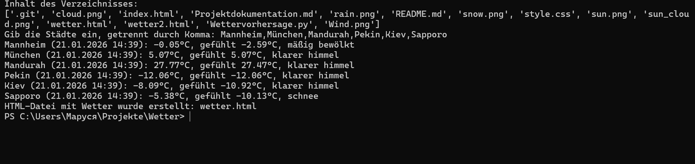
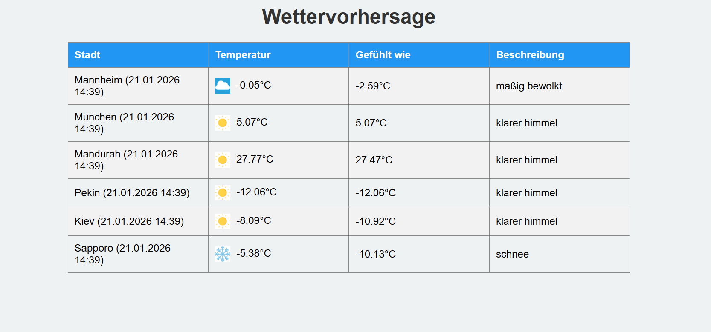

Wettervorhersage Projekt – Projektdokumentation

Das Ziel des Projekts ist es, die aktuelle Wettervorhersage für eine beliebige Stadt anzuzeigen.

Die Daten werden von der OpenWeatherMap API abgerufen.

Die Ausgabe erfolgt sowohl in der Konsole als auch in einer HTML-Tabelle im Browser.

Wetter-Icons zeigen Sonne, Wolken, Regen, Schnee, Wind oder Sonne+Wolken an.

### Beispielhafte Ausgabe in der Konsole

### Beispielhafte Ausgabe im Browser

Verwendete Dateien

Wettervorhersage.py	Hauptskript, das Wetterdaten abruft und HTML generiert

index.html	Vorlage für die HTML-Tabelle

style.css	Styling für die Tabelle und Icons

sun.png, cloud.png, rain.png, snow.png, wind.png, sun\_cloud.png	Wetter-Icons

wetter.html	Vom Skript erzeugte HTML-Datei

screenshots/	Ordner für Beispiel-Screenshots (optional)
 
Funktionsweise

Städte auswählen:

Der Nutzer kann die Städte direkt in der Konsole eingeben.

Wetterdaten abrufen:

Das Skript nutzt die OpenWeatherMap API über HTTP-Anfragen (requests).

Temperatur, gefühlte Temperatur, Beschreibung der Wetterlage werden ausgelesen.

Icon auswählen:

Je nach Wetterbeschreibung wird ein passendes Icon gewählt (z. B. sun.png für Klarer Himmel).

HTML generieren:

Die Wetterdaten werden in die Vorlage index.html eingefügt.

Ergebnis wird in wetter.html gespeichert.

Ergebnis anzeigen:

Konsolenausgabe zeigt die aktuellen Werte der gewählten Städte.

Browser öffnet automatisch die Datei wetter.html.

Benutzeranleitung

Stelle sicher, dass alle Dateien (Wettervorhersage.py, index.html, style.css, Icons) im selben Ordner liegen.

Starte die Konsole (PowerShell oder Terminal) im Projektordner.

Führe das Skript aus:

python Wettervorhersage.py

Gib, falls gewünscht, eine Stadt ein, um deren Wetter zu sehen.

Die HTML-Datei wetter.html öffnet sich automatisch im Browser.

Technische Hinweise

Programmiersprache: Python 3.x

Bibliotheken: requests, datetime, webbrowser

Wetter-API: OpenWeatherMap (API-Key erforderlich)

HTML/CSS für Darstellung der Tabelle und Icons.

